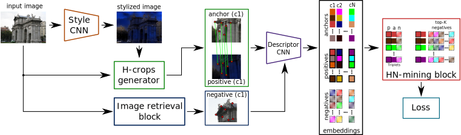

# Digging Into Self-Supervised Learning of Feature Descriptors
This repository contains the PyTorch implementation of our work [Digging Into Self-Supervised Learning of Feature Descriptors](https://imelekhov.com/hndesc/) accepted at 3DV 2021.

<p align="center">
  <a href="https://arxiv.org/abs/2110.04773"></a>
  <br /><em>Local image descriptors learning pipeline</em>
</p>


# BibTeX
If you find our work useful, please cite *both* papers:
```
  @inproceedings{Melekhov2021hardnet,
    title = {Digging Into Self-Supervised Learning of Feature Descriptors},
    author = {Melekhov, Iaroslav and Laskar, Zakaria and Li, Xiaotian and Wang, Shuzhe and Kannala Juho},
    booktitle = {In Proceedings of the International Conference on 3D Vision (3DV)},
    year = {2021}}

  @article{Melekhov2020Nian,
    author = {{Melekhov, Iaroslav and Brostow, Gabriel J. and Kannala, Juho and Turmukhambetov, Daniyar},
    title = {Image Stylization for Robust Features},
    journal = {Arxiv preprint arXiv:2008.06959},
    year = {2020}}
```
