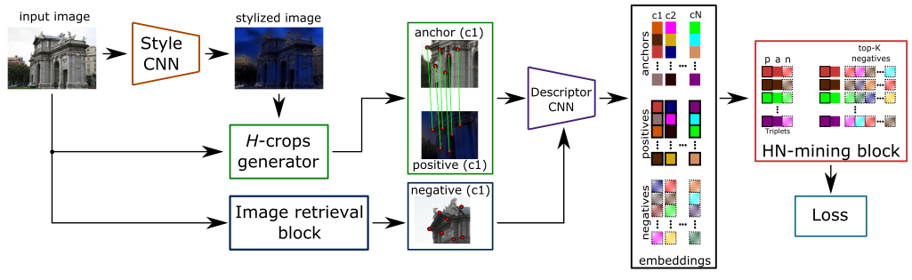
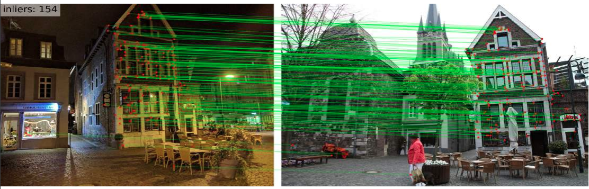
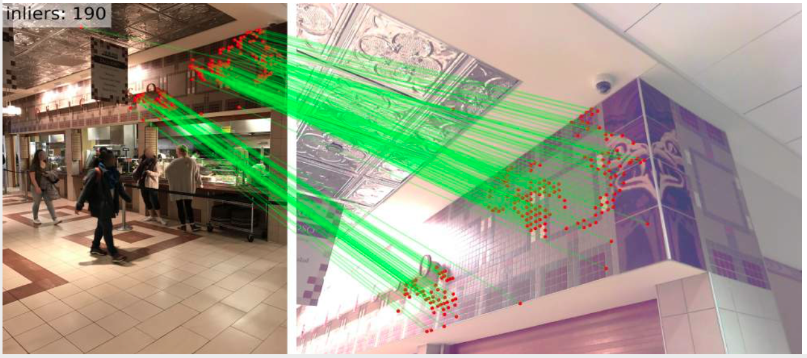
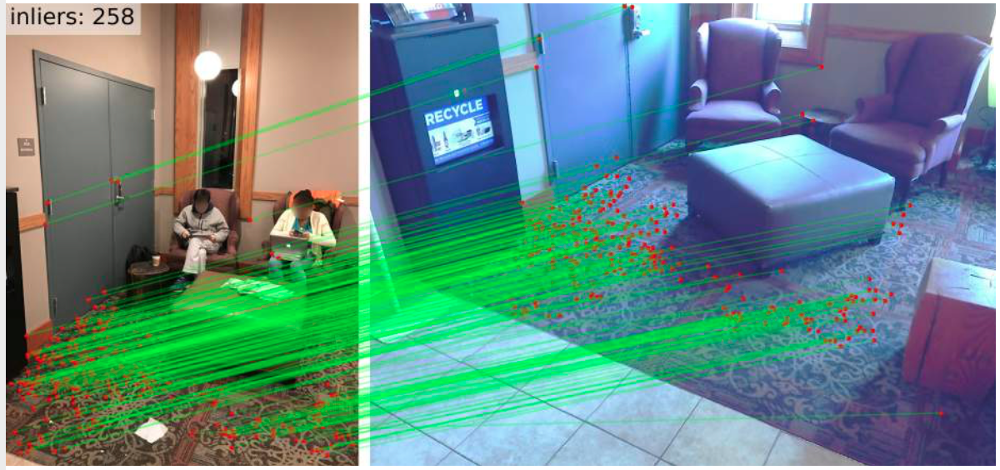

# Digging Into Self-Supervised Learning of Feature Descriptors
This repository contains the PyTorch implementation of our work **Digging Into Self-Supervised Learning of Feature Descriptors** presented at 3DV 2021 
[[Project page]](https://imelekhov.com/hndesc/)
[[ArXiv]](https://arxiv.org/abs/2110.04773)

TL;DR: The paper proposes an Unsupervised CNN-based local descriptor that is robust to illumination changes and competitve with its fully-(weakly-)supervised counterparts.

<p align="center">
  <a href="https://arxiv.org/abs/2110.04773"></a>
  <br /><em>Local image descriptors learning pipeline</em>
</p>

## Requirements
```
conda create -n hndesc_env python=3.9
conda activate hndesc_env
pip install -r requirements.txt
```

## Evaluation
The pretrained models are available [here](https://drive.google.com/file/d/1bHJzHK6lMW424d72MpB3M6Se_tXAbSq4/view?usp=sharing).
The data (~24 Gb) is available [here](https://drive.google.com/file/d/18Wv0XIIMEsYeUNvbLX4GExncRyilj_WG/view?usp=sharing).

We provide code for evaluation HNDesc on the following benchmarks/tasks:

### HPatches

### Image retrieval

### Camera relocalization


## Qualitative results

### Aachen
<p align="center">
  
  
</p>

### InLOC
<p align="center">
  
  
</p>

## Requirements
```
conda create -n hndesc_env python=3.9
conda activate hndesc_env
pip install -r requirements.txt
```


## Cite
If you find our work useful, please cite *both* papers:
```bibtex
  @inproceedings{Melekhov2021hardnet,
    title = {Digging Into Self-Supervised Learning of Feature Descriptors},
    author = {Melekhov, Iaroslav and Laskar, Zakaria and Li, Xiaotian and Wang, Shuzhe and Kannala Juho},
    booktitle = {In Proceedings of the International Conference on 3D Vision (3DV)},
    year = {2021}}

  @article{Melekhov2020Nian,
    author = {{Melekhov, Iaroslav and Brostow, Gabriel J. and Kannala, Juho and Turmukhambetov, Daniyar},
    title = {Image Stylization for Robust Features},
    journal = {Arxiv preprint arXiv:2008.06959},
    year = {2020}}
```
