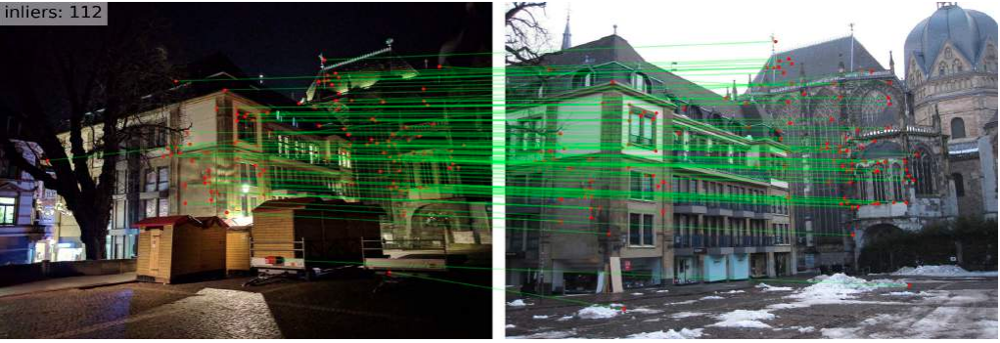

# Digging Into Self-Supervised Learning of Feature Descriptors
This repository contains the PyTorch implementation of our work **Digging Into Self-Supervised Learning of Feature Descriptors** presented at 3DV 2021
[[Project page]](https://imelekhov.com/hndesc/)
[[ArXiv]](https://arxiv.org/abs/2110.04773)

TL;DR: The paper proposes an Unsupervised CNN-based local descriptor that is robust to illumination changes and competitve with its fully-(weakly-)supervised counterparts.

<p align="center">
  <a href="https://arxiv.org/abs/2110.04773"></a>
  <br /><em>Local image descriptors learning pipeline</em>
</p>

## Requirements
```
conda create -n hndesc_env python=3.9
conda activate hndesc_env
pip install -r requirements.txt
```
The pretrained models are available [here](https://drive.google.com/file/d/1bHJzHK6lMW424d72MpB3M6Se_tXAbSq4/view?usp=sharing). In this project, we use the [Hydra](https://hydra.cc/docs/intro/) library to handle JSON-based config files.

## Training
Please download the preprocessed original MegaDepth dataset, its stylized copy, and precomputed SuperPoint keypoints and unzip to `$HNDESC_TRAIN_DATA`. The data (~24 Gb) is available on [GDrive](https://drive.google.com/file/d/18Wv0XIIMEsYeUNvbLX4GExncRyilj_WG/view?usp=sharing). Once the data is downloaded, please do the following:
- Modify the `HNDesc/configs/main.yaml` config file by changing the key `data_params.dataset_dir` to `$HNDESC_TRAIN_DATA`
- Start training by running `python train.py`

One can specify the backbone network `[caps, r2d2]` as well as the batch size, learning rate, and the number of training iterations by changing specific keys of the config file.


## Qualitative results

### Aachen
<p align="center">
  
  
</p>

### InLOC
<p align="center">
  
  
</p>

## Evaluation
We provide code for evaluation HNDesc on the following benchmarks/tasks: image matching (HPatches), image retrieval (rOxford5k, rParis6k, and Tokyo24/7), and camera relocalization (Aachen v1.1). The code is available under `experiments/`. Download the model [weights](https://drive.google.com/file/d/1bHJzHK6lMW424d72MpB3M6Se_tXAbSq4/view?usp=sharing) and extract them to `assets/`.

### HPatches
Once the model weights obtained, there are two ways of evaluation on HPatches:

One can run the `eval_on_hpatches.sh` script that automatically downloads the HPatches dataset and performs evaluation. Before evaluation, it is required to specify `$DATASETS_PATH` where the dataset is going to be downloaded.

Or manually change the config files:
  - Open `experiments/configs/main.yaml` and change the following keys:
    - `defaults.task` to `hpatches`
    - `defaults.descriptor` to `hndesc`
    - `paths.datasets_home_dir` to `$DATASETS_PATH`
  - Run `python main.py` under `experiments/`

Once finished, the extracted features as well as a txt file with the results are saved at `HNDesc/output_hndesc/extracted_kpts_descs/hpatches/superpoint_orig-n-1-rNone__hndesc_caps_hndesc_caps_MP_st/`. For the model specified in `eval_on_hpatches.sh` the output txt file is the following:

  ```
  PCK benchmark:
  MMA@1 v/i/avg: 0.250 / 0.426 / 0.338
  MMA@2 v/i/avg: 0.505 / 0.602 / 0.554
  MMA@3 v/i/avg: 0.630 / 0.716 / 0.673
  MMA@4 v/i/avg: 0.695 / 0.778 / 0.737
  MMA@5 v/i/avg: 0.732 / 0.822 / 0.777
  MMA@6 v/i/avg: 0.757 / 0.845 / 0.801
  MMA@7 v/i/avg: 0.774 / 0.862 / 0.818
  MMA@8 v/i/avg: 0.787 / 0.879 / 0.833
  MMA@9 v/i/avg: 0.797 / 0.894 / 0.846
  MMA@10 v/i/avg: 0.806 / 0.906 / 0.856
  Homography benchmark:
  th: 1 v/i/avg: 0.207 / 0.492 / 0.344
  th: 3 v/i/avg: 0.557 / 0.858 / 0.702
  th: 5 v/i/avg: 0.700 / 0.973 / 0.831
  th: 10 v/i/avg: 0.846 / 0.996 / 0.919
  ```


### Image retrieval
Download the rOxford5k, rParis6k datasets, and the list of precomputed nearest neighbors using the following [GDrive link (~4.5Gb)](https://drive.google.com/file/d/1dRk7ifDls2QLxZ9weZQkZ_b0mFl1AGnr/view?usp=sharing). Copy the downloaded archive to `$EVAL_DATASETS_PATH` and extract it there. Modify the `experiments/configs/main.yaml` config file in the following way:
- `defaults.task` to `image_retrieval_radenovic`
- `paths.datasets_home_dir` to `$EVAL_DATASETS_PATH`
- Run `python main.py` under `experiments/`

### Camera relocalization
- Install [COLMAP](https://colmap.github.io/) to $COLMAP_DIR
- Modify the `paths.colmap_dir` key in `experiments/configs/task/localization_aachen_v11.yaml` to `$COLMAP_DIR`
- Download the preprocessed data using the following [GDrive link (~6.5Gb)](https://drive.google.com/file/d/1BYip8o_e3tO6FKNjmsyUMSSjrTd-mEJV/view?usp=sharing) and copy to `$EVAL_DATASETS_PATH`
- Modify the `paths.datasets_home_dir` key in `experiments/configs/main.yaml` to `$EVAL_DATASETS_PATH`
- Modify the `defaults.task` key in `experiments/configs/main.yaml` to `localization_aachen_v11`
- Run `python main.py` under `experiments/`
The resulted file with predicted query poses is placed at `output_hndesc/extracted_kpts_descs/visual_localization/pred.txt` and one can upload it to `https://www.visuallocalization.net/` to get localization performance.


## Cite
If you find our work useful, please cite *both* papers:
```bibtex
  @inproceedings{Melekhov2021hardnet,
    title = {Digging Into Self-Supervised Learning of Feature Descriptors},
    author = {Melekhov, Iaroslav and Laskar, Zakaria and Li, Xiaotian and Wang, Shuzhe and Kannala Juho},
    booktitle = {In Proceedings of the International Conference on 3D Vision (3DV)},
    year = {2021}}

  @article{Melekhov2020Nian,
    author = {{Melekhov, Iaroslav and Brostow, Gabriel J. and Kannala, Juho and Turmukhambetov, Daniyar},
    title = {Image Stylization for Robust Features},
    journal = {Arxiv preprint arXiv:2008.06959},
    year = {2020}}
```
